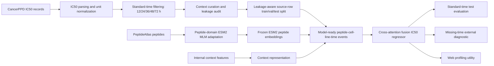
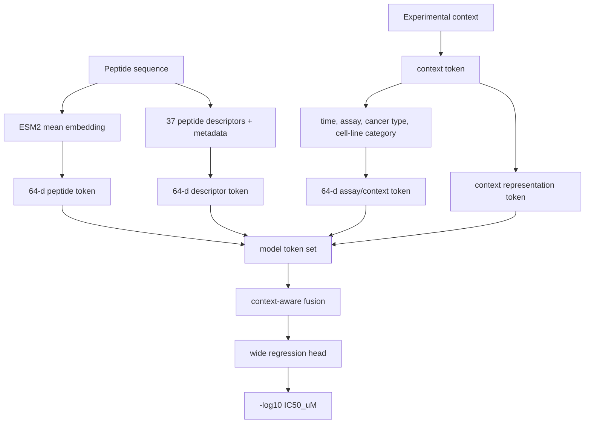
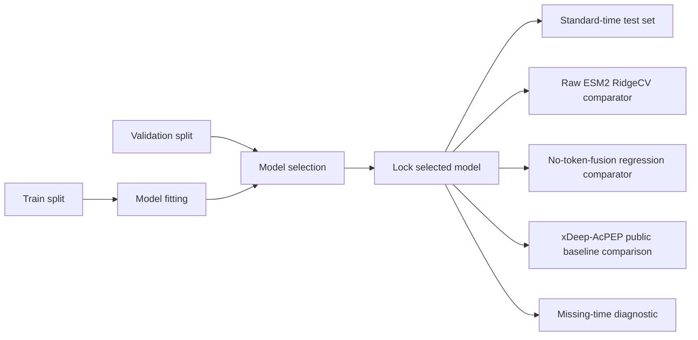

# Architecture

## End-to-End Workflow

## Model Inputs

## Evaluation Design

## Portfolio Scope

This diagram intentionally abstracts internal feature engineering details. The public version is meant to show the research design without exposing the full internal training recipe.
