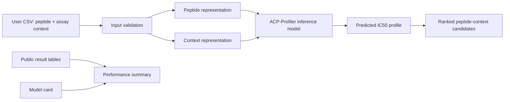
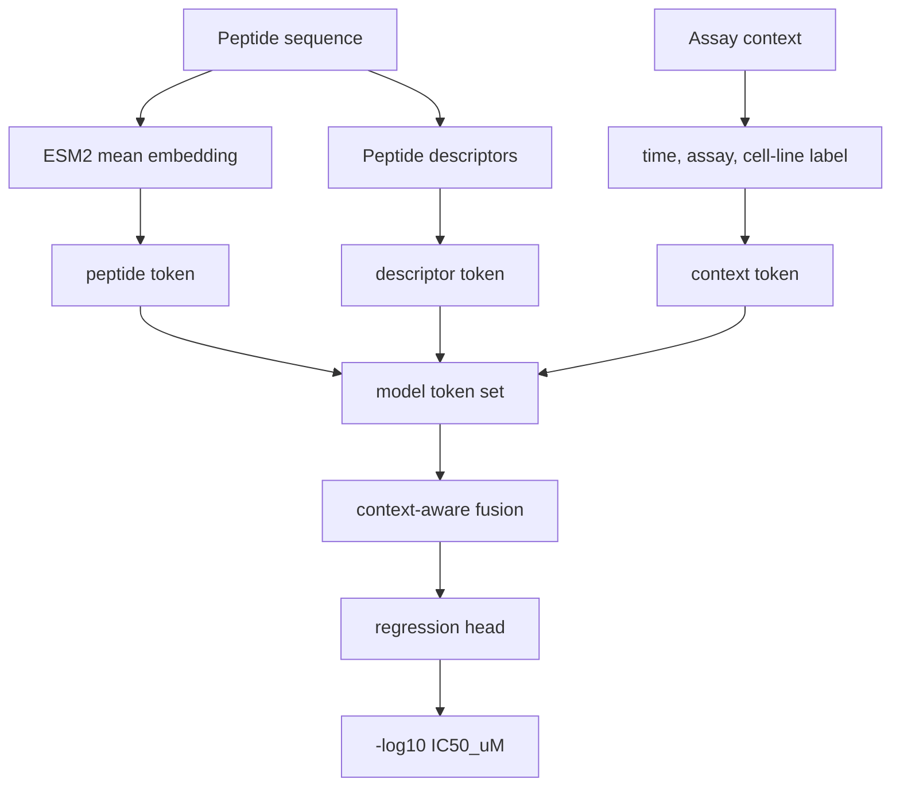
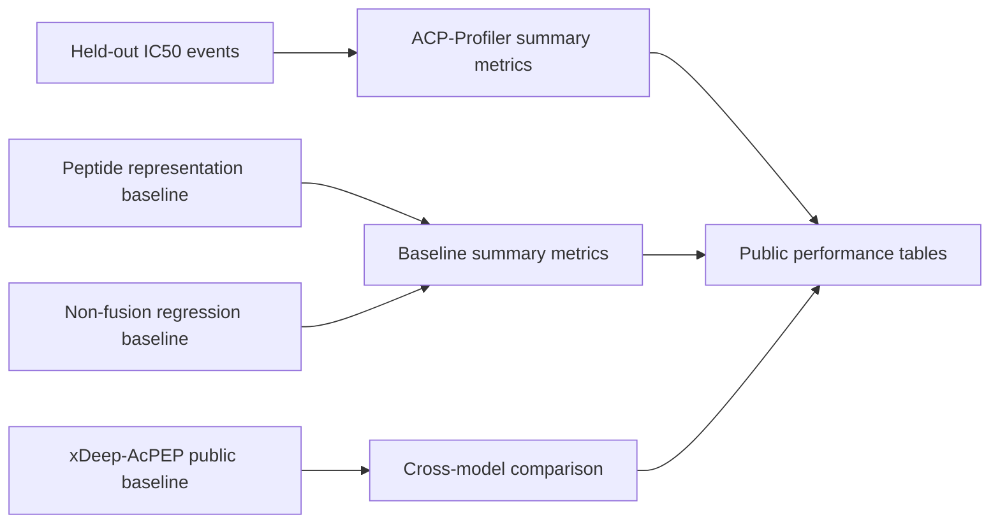

# Architecture

## End-to-End Workflow

The public workflow is inference-oriented. It documents the expected user input
and output contract without exposing the internal training, feature-generation,
or model-selection pipeline.

## Model Inputs

## Evaluation Design

Evaluation details are reported at summary level only. The public repository
keeps row-level datasets, split files, comparator scripts, and training code out
of scope while still documenting the benchmark logic and final metrics.

## Portfolio Scope

These diagrams intentionally abstract internal feature engineering details. The
public version is meant to show the model interface, architectural reasoning,
and evaluation logic without exposing the full internal training recipe.
